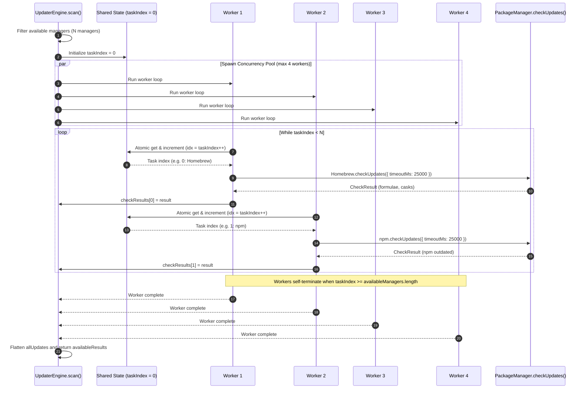
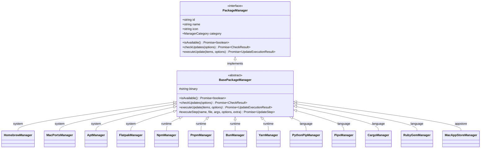
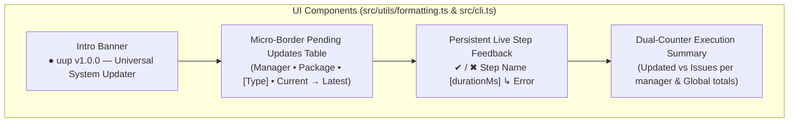

# Universal Updater (`uup`) — System Architecture & Design

## 1. Architectural Principles

Universal Updater is architected around four core design tenets:

1. **Provider / Adapter Pattern**: Each package manager is implemented as an autonomous adapter conforming to a unified [`PackageManager`](src/types.ts#L58-L67) interface. High-level orchestrators never interact with manager-specific CLI syntax directly.
2. **Resilience First (Fault Isolation)**: No single tool failure, command timeout, missing binary, or network disruption can crash the engine. All checks and execution steps run inside defensive try/catch wrappers that produce structured error states instead of unhandled rejections.
3. **Two-Phase Lifecycle**: Mutative operations are strictly decoupled from inspection:
   - **Phase 1 (Inspection)**: Read-only, highly concurrent discovery and outdated analysis.
   - **Phase 2 (Execution)**: Interactive review followed by sequential, controlled, and observable command execution.
4. **Idempotence & Safety**: The system detects environment constraints early (e.g. non-interactive sudo verification, PEP 668 protections, Homebrew-managed binaries) and features a true simulated dry-run mode that exercises all engine mechanics without issuing mutative commands.

---

## 2. High-Level Two-Phase Workflow

The lifecycle is divided into five distinct stages spanning the two main phases:

```mermaid
flowchart TD
    subgraph CLI ["CLI Entry (src/cli.ts)"]
        Start(["uup invocation"]) --> ParseFlags["Parse Commander Options\n(--dry-run, --yes, --only, --exclude)"]
        ParseFlags --> InitReg["Initialize Default Managers\n(src/managers/registry.ts)"]
        InitReg --> Filter["Apply Name / ID Filters"]
    end

    subgraph Phase1 ["Phase 1: Discovery & Outdated Scan"]
        Filter --> ParallelAvail["Parallel isAvailable() Checks\n(Promise.all with try/catch)"]
        ParallelAvail --> Pool["Bounded Worker Pool (Concurrency: 4)\n(src/core/engine.ts)"]
        Pool --> QueryBrew["Homebrew\nbrew outdated --json=v2"]
        Pool --> QueryNPM["npm\nnpm outdated -g --json"]
        Pool --> QueryYarn["Yarn\nHTTP registry.npmjs.org"]
        Pool --> QueryPipx["pipx\nHTTP pypi.org API"]
        Pool --> QueryOthers["Other Managers\n(pnpm, bun, pip, gem, port, mas, apt, flatpak)"]
        QueryBrew & QueryNPM & QueryYarn & QueryPipx & QueryOthers --> AggUpdates["Aggregate Updates & Warnings"]
    end

    subgraph Phase1_Review ["Interactive Review & Decision Gate"]
        AggUpdates --> ZeroCheck{"Any updates pending?"}
        ZeroCheck -- "No (0 updates)" --> ExitClean(["Display 'Up to Date' & Exit (0)"])
        ZeroCheck -- "Yes (>0 updates)" --> RenderTable["Render Minimalist Micro-Border Table\n(Manager, Package, Type, Current → Latest)"]
        RenderTable --> ConfirmGate{"Confirmation Mode"}
        ConfirmGate -- "--dry-run" --> SetDryRun["Select All (dryRun = true)"]
        ConfirmGate -- "--yes" --> SetYes["Select All (dryRun = false)"]
        ConfirmGate -- "Interactive" --> PromptClack["@clack/prompts\n(All / Select Specific / Cancel)"]
        PromptClack -- "Cancel" --> ExitCancel(["Exit (0)"])
        PromptClack -- "Select Specific" --> MultiSelect["Prompt Multiselect Managers"]
    end

    subgraph Phase2 ["Phase 2: Controlled Sequential Execution"]
        SetDryRun & SetYes & PromptClack & MultiSelect --> EngineExec["UpdaterEngine.execute()\n(Sequential Manager Iteration)"]
        EngineExec --> ManagerLoop["For each selected manager"]
        ManagerLoop --> SudoPreCheck{"Privilege Check\n(MacPorts / APT)"}
        SudoPreCheck -- "sudo -n true fails" --> FastFail["Fail Step Fast with Guidance"]
        SudoPreCheck -- "Privileges OK or User" --> ExecRoutine["Execute Manager Update Routine"]
        ExecRoutine --> StepExec["BasePackageManager.executeStep()"]
        StepExec --> DryBranch{"Is dryRun?"}
        DryBranch -- "Yes" --> SimStep["Log [DRY-RUN] & Return Simulated Success"]
        DryBranch -- "No" --> SafeExecCmd["safeExec() via execa\n(CI=true, stream output, 180s timeout)"]
        SafeExecCmd --> StepEval{"Step exitCode == 0?"}
        StepEval -- "Yes" --> StepDone["Record Step Status ('success')"]
        StepEval -- "No" --> ErrExtract["extractErrorMessage(rawStderr)\n(Strip warnings, isolate cause)"] --> StepFailDone["Record Step Status ('failed')"]
        SimStep --> StepDone
        StepDone & StepFailDone --> LiveProgress["onStepEnd: Print persistent marker\n✔ / ✖ stepName [durationMs]"]
        LiveProgress --> MoreSteps{"More steps?"}
        MoreSteps -- "Yes" --> ExecRoutine
        MoreSteps -- "No" --> ManagerDone["Record Manager Execution Result"]
        ManagerDone --> MoreManagers{"More managers?"}
        MoreManagers -- "Yes" --> ManagerLoop
        MoreManagers -- "No" --> FinalSummary["Generate GlobalSummary"]
    end

    subgraph SummaryStage ["Stage 5: Final Presentation & Exit"]
        FinalSummary --> RenderSummary["Render Execution Summary Table & Durations"]
        RenderSummary --> EvalStatus{"Any failures?"}
        EvalStatus -- "failedCount == 0" --> ExitSuccess(["Exit 0 (Success)"])
        EvalStatus -- "failedCount > 0" --> ExitWarn(["Exit 1 (Warnings / Failures)"])
    end
```

---

## 3. Engine Concurrency Pool

During the check phase, querying all package managers sequentially would incur substantial latency, while unbounded `Promise.all` can saturate CPU, network sockets, or file descriptors.

[`UpdaterEngine.scan()`](src/core/engine.ts#L50-L84) employs a **bounded worker pool pattern**:

### Key Concurrency Invariants:
1. **Worker Count**: `const concurrency = Math.min(4, availableManagers.length);`
2. **Zero Stranded Work**: Workers dynamically claim tasks from the shared counter (`taskIndex++`), ensuring fast checks (such as local CLI queries) do not block on slower network checks.
3. **Complete Error Containment**: Each check task wraps `manager.checkUpdates` in a try/catch block. If an unhandled error or rejection occurs, a synthetic `fallbackRes` with `error: err.message` is returned, guaranteeing that `checkResults[idx]` is always populated.

---

## 4. Provider Hierarchy & Class Relationships

All package managers inherit from the abstract [`BasePackageManager`](src/managers/base.ts#L13), providing a uniform template method for step execution, logging, and error tracking:

### Responsibilities of [`BasePackageManager`](src/managers/base.ts):
- **Availability Default**: Implements `isAvailable()` by invoking `commandExists(this.binary)` using system `which`. Concrete classes override this when additional path validation is required (e.g. `RubyGemManager` skips `/usr/bin/gem`, `CargoManager` checks both `cargo` and `rustup`).
- **Standardized Step Execution ([`executeStep`](src/managers/base.ts#L31))**:
  - Intercepts `options.dryRun` to prevent subprocess execution while providing simulated console feedback.
  - Spawns commands via [`safeExec`](src/utils/exec.ts#L40) with default 180s timeouts.
  - Emits real-time progress callbacks (`onStepStart`, `onStepProgress`, `onStepEnd(step, success, error, durationMs)`).
  - Sanitizes step failure messages using [`extractErrorMessage`](src/utils/formatting.ts#L6) before recording step error.
  - Records step status, timing, and actionable failure messages.

---

## 5. Execution Step & Resilience Mechanics

Every update step inside a manager flows through the execution pipeline:

```mermaid
flowchart LR
    StepStart(["executeStep(name, file, args)"]) --> DryCheck{"options.dryRun?"}

    DryCheck -- "true" --> DryLog["onStepProgress: [DRY-RUN] Would run..."]
    DryLog --> DryEnd["onStepEnd(true, duration: 0ms)"]
    DryEnd --> DryReturn["Return UpdateStep\n(status: 'success', duration: 0ms)"]

    DryCheck -- "false" --> SafeExecCall["safeExec(file, args, options)"]
    SafeExecCall --> EnvInject["Set CI=true\nSet DEBIAN_FRONTEND=noninteractive\nstdin: 'ignore'"]
    EnvInject --> ExecaSubprocess["execa child process\n(timeout: 180s)"]
    ExecaSubprocess --> StreamHook["stdout / stderr 'data' listener\n-> onStepProgress(lastLine)"]
    StreamHook --> ExecaWait["await subprocess"]
    ExecaWait --> ResultEval{"result.exitCode == 0?"}

    ResultEval -- "Yes" --> StepSuccess["Status: 'success'"]
    ResultEval -- "No" --> TimeoutCheck{"result.timedOut?"}
    TimeoutCheck -- "Yes" --> TimedOutErr["Error: 'Step timed out after Ns'"]
    TimeoutCheck -- "No" --> ExtractErr["extractErrorMessage(rawOutput)\n(Filter npm warn, isolate errors)"]
    TimedOutErr & ExtractErr --> StepFail["Status: 'failed'"]

    StepSuccess & StepFail --> CallbackEnd["onStepEnd(name, success, errorMsg, durationMs)"]
    CallbackEnd --> ReturnStep["Return UpdateStep\n(duration, status, error)"]
```

### Specific Resilience Strategies:
1. **MacPorts & APT Non-Interactive Sudo**: Before attempting `sudo port` or `sudo apt-get`, managers test credentials via `sudo -n true`. If cached privileges have expired, they fail immediately with actionable user advice, avoiding a 3-minute freeze.
2. **Bun & Yarn Global Semver Override**: Standard `bun update -g` and `yarn global upgrade` obey version ranges stored in their global manifest files, ignoring newer major releases. Both managers prepend explicit `add -g <pkg>@latest` steps to force upgrades across major semver boundaries.
3. **Bun Coexistence with Homebrew**: Calling `bun upgrade` when Bun was installed via Homebrew produces errors or broken symlinks. `BunManager` inspects `which bun` and skips self-upgrade if managed by Homebrew.
4. **npm Targeted Batching, Multi-Tier Fallback & Script Recovery**: `NpmManager` targets outdated packages directly via `npm install -g --legacy-peer-deps -- <pkg>@<latest>...`. Package targets use POSIX `--` separation to avoid colliding with CLI flags. If only 1 package is outdated, it proceeds straight to isolated install; if a batch install fails (e.g. peer conflicts), the batch step is marked `status = 'skipped'` (fallback trigger) and it falls back to isolated per-package installation. If an individual package fails due to install lifecycle scripts (`only-allow pnpm`, `node-gyp`), it automatically retries with `--ignore-scripts -- <target>`.
5. **Native HTTP Registry Lookups (Yarn & Pipx)**: Rather than spawning hundreds of `npm view` or `pip index` sub-processes, Yarn and pipx make concurrent HTTP `fetch` requests directly to `registry.npmjs.org` and `pypi.org` with 3-second abort signals.
6. **Homebrew Non-Redundant Targeted Upgrades**: `HomebrewManager` inspects pending item classifications. If only casks are pending, it runs `brew upgrade --cask` (bypassing formula graph resolution). If only formulae are pending, it runs `brew upgrade --formula`. If both are pending, it runs `brew upgrade`.
7. **Sanitized Error Extraction**: Raw stderr and stdout often contain non-fatal runtime warnings (`npm warn`, `warning:`, `notice`) or truncated JSON dumps that mask the actual failure. `extractErrorMessage()` filters ambient notices, extracts specific error lines (`npm error`, `fatal:`, `command failed`), and cleanly truncates output for compact display.

---

## 6. UI/UX & Live Feedback Architecture

The CLI presentation layer balances minimalist aesthetics with high information density:

1. **Micro-Border Alignment**: The pending updates table replaces heavy double-line ASCII boxes with subtle micro-borders and combines version columns into a directional transition (`currentVersion → latestVersion`).
2. **Persistent Step Logging**: Instead of an ephemeral spinner that wipes previous step records, `onStepEnd` terminates the active spinner line with a permanent status mark (`✔ brew update [1.2s]`), then immediately restarts the spinner for subsequent tasks.
3. **Fallback Concealment**: Intermediate fallback trigger steps (such as the initial npm batch step that fell back to per-package installs) are marked `status: 'skipped'` and suppressed in the final summary card so users only see actionable results.
4. **Dual-Counter Accounting**: Execution summaries explicitly distinguish between successfully updated packages and encountered issues (`• 5 updated, 1 issue(s)`), providing exact clarity.
